# 📘 Blog API – Authors & Posts (RESTful API)

This project is a RESTful Blog API built using **Node.js, Express, Sequelize, and MySQL**.

It demonstrates a **One-to-Many Relationship**:

- One Author → Many Posts
- Deleting an author deletes all posts (**CASCADE DELETE**)
- A post must belong to a valid author (**Foreign Key Validation**)

---

# 🚀 Tech Stack

- Node.js
- Express.js
- Sequelize ORM
- MySQL
- Thunder Client

---

# 🛠️ Setup Instructions

## ✔ 1. Install Dependencies

npm install

## ✔ 2. Configure Database Connection

Edit config/database.js and update the MySQL credentials:

const sequelize = new Sequelize("blogdb", "root", "your_mysql_password", {
host: "localhost",
dialect: "mysql",
logging: false
});

## ✔ 3. Create MySQL Database

Open MySQL Workbench or terminal and run:

CREATE DATABASE blogdb;

## ✔ 4. Start the Server

npx nodemon app.js

Expected Output:

Database synced successfully.
Server running on port 3000

# 📚 API Documentation

This section describes all REST API endpoints for the Blog API, including Authors and Posts.

To ensure API testing works even after deleting records, examples include **two authors** and **multiple posts**.

---

# 🧑‍💼 AUTHOR ENDPOINTS

---

## ➤ 1. Create Author (Example 1)

**POST** `/authors`

### Request Body:

{
"name": "John Doe",
"email": "john@example.com"
}

### Response:

{
"id": 1,
"name": "John Doe",
"email": "john@example.com"
}

---

## ➤ 1. Create Author (Example 2)

**POST** `/authors`

### Request Body:

{
"name": "Alice Johnson",
"email": "alice@example.com"
}

### Response:

{
"id": 2,
"name": "Alice Johnson",
"email": "alice@example.com"
}

---

## ➤ 2. Get All Authors

**GET** `/authors`

### Response:

[
{
"id": 1,
"name": "John Doe",
"email": "john@example.com"
},
{
"id": 2,
"name": "Alice Johnson",
"email": "alice@example.com"
}
]

---

## ➤ 3. Get Author by ID (Example)

**GET** `/authors/2`

### Response:

{
"id": 2,
"name": "Alice Johnson",
"email": "alice@example.com"
}

---

## ➤ 4. Update Author (Example)

**PUT** `/authors/2`

### Request Body:

{
"name": "Alice Developer"
}

### Response:

{
"id": 2,
"name": "Alice Developer",
"email": "alice@example.com"
}

---

## ➤ 5. Delete Author

**DELETE** `/authors/1`

### Response:

{
"message": "Author and related posts deleted"
}

(Author 2 will still exist for further testing.)

---

## ➤ 6. Get All Posts of a Specific Author (Example)

**GET** `/authors/2/posts`

### Response:

[
{
"id": 4,
"title": "Alice First Post",
"content": "Post by Alice",
"author_id": 2
}
]

---

# 📝 POST ENDPOINTS

---

## ➤ 7. Create Post (Author 1)

**POST** `/posts`

### Request Body:

{
"title": "John's First Post",
"content": "Hello from John!",
"author_id": 1
}

### Response:

{
"id": 1,
"title": "John's First Post",
"content": "Hello from John!",
"author_id": 1
}

---

## ➤ 8. Create Post (Author 2)

**POST** `/posts`

### Request Body:

{
"title": "Alice's First Post",
"content": "This is Alice's first post",
"author_id": 2
}

### Response:

{
"id": 2,
"title": "Alice's First Post",
"content": "This is Alice's first post",
"author_id": 2
}

---

## ➤ 9. Get All Posts (With Author Details)

**GET** `/posts`

### Response:

[
{
"id": 1,
"title": "John's First Post",
"content": "Hello from John!",
"author": {
"name": "John Doe",
"email": "john@example.com"
}
},
{
"id": 2,
"title": "Alice's First Post",
"content": "This is Alice's first post",
"author": {
"name": "Alice Johnson",
"email": "alice@example.com"
}
}
]

---

## ➤ 10. Filter Posts by Author

**GET** `/posts?author_id=2`

### Response:

[
{
"id": 2,
"title": "Alice's First Post",
"content": "This is Alice's first post",
"author": {
"name": "Alice Johnson",
"email": "alice@example.com"
}
}
]

---

## ➤ 11. Get Post by ID (Example)

**GET** `/posts/2`

### Response:

{
"id": 2,
"title": "Alice's First Post",
"content": "This is Alice's first post",
"author": {
"name": "Alice Johnson",
"email": "alice@example.com"
}
}

---

## ➤ 12. Update Post

**PUT** `/posts/2`

### Request Body:

{
"title": "Alice Updated Post"
}

### Response:

{
"id": 2,
"title": "Alice Updated Post",
"content": "This is Alice's first post",
"author_id": 2
}

---

## ➤ 13. Delete Post

**DELETE** `/posts/2`

### Response:

{
"message": "Post deleted"
}

---

# 📸 API Testing Screenshots

Below are the screenshots of all API endpoints tested using Thunder Client.  
All images are stored in the `/screenshots/` folder.

---

## 🧑‍💼 AUTHOR ENDPOINTS

### 1️⃣ Create Author — `POST /authors`

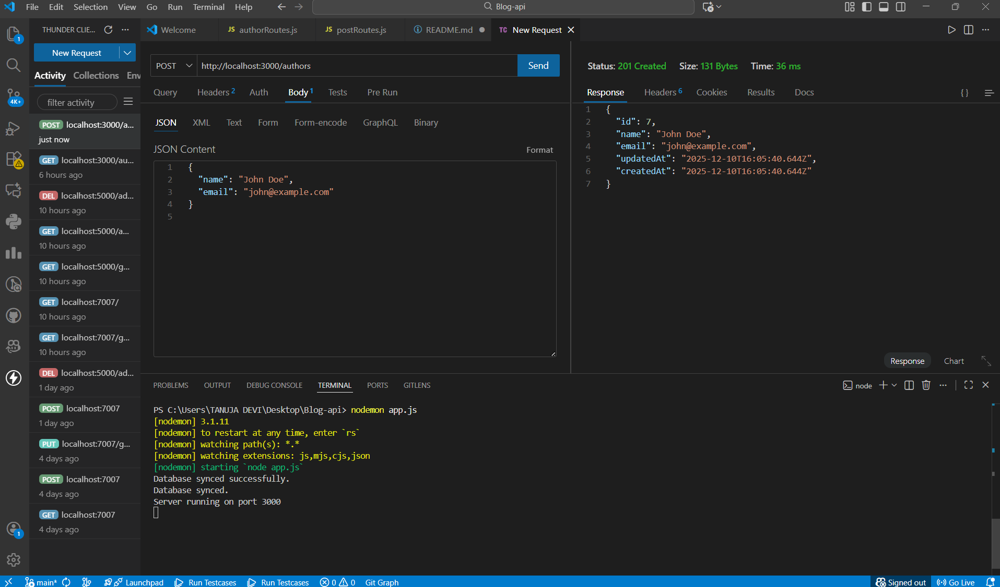

---

### 2️⃣ Get All Authors — `GET /authors`

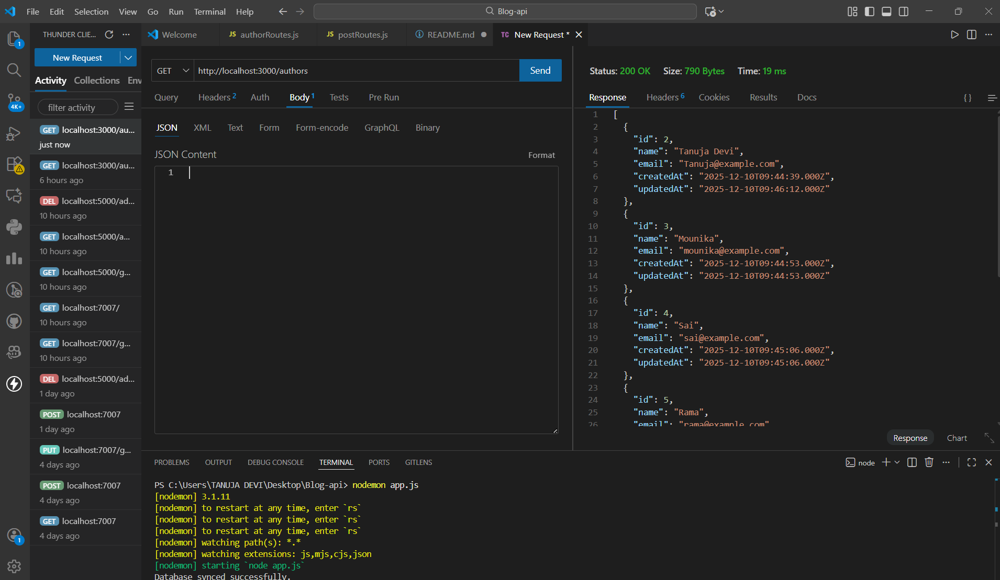

---

### 3️⃣ Get Author by ID — `GET /authors/{id}`

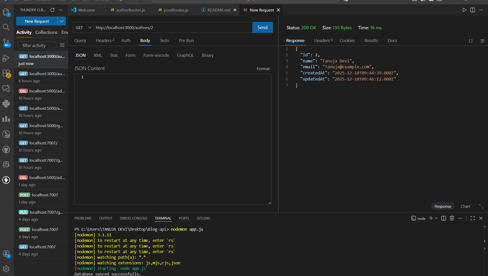

---

### 4️⃣ Update Author — `PUT /authors/{id}`

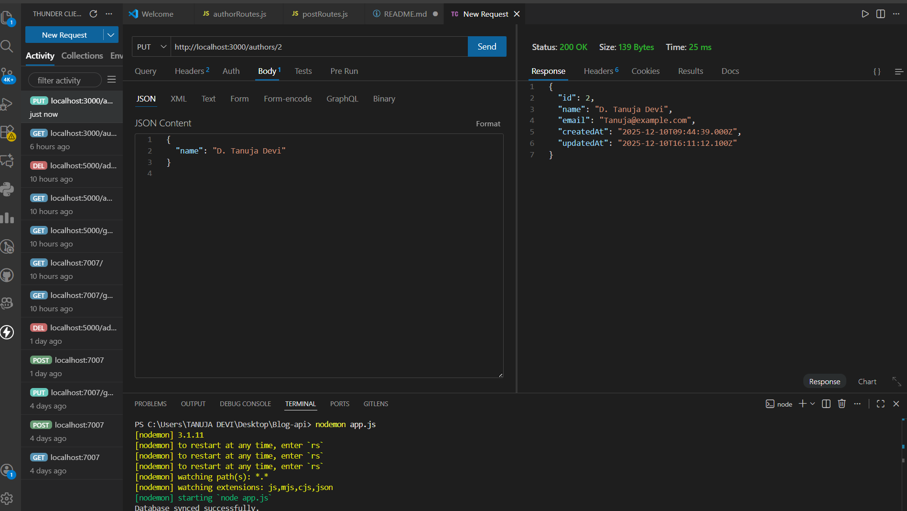

---

### 5️⃣ Delete Author — `DELETE /authors/{id}`

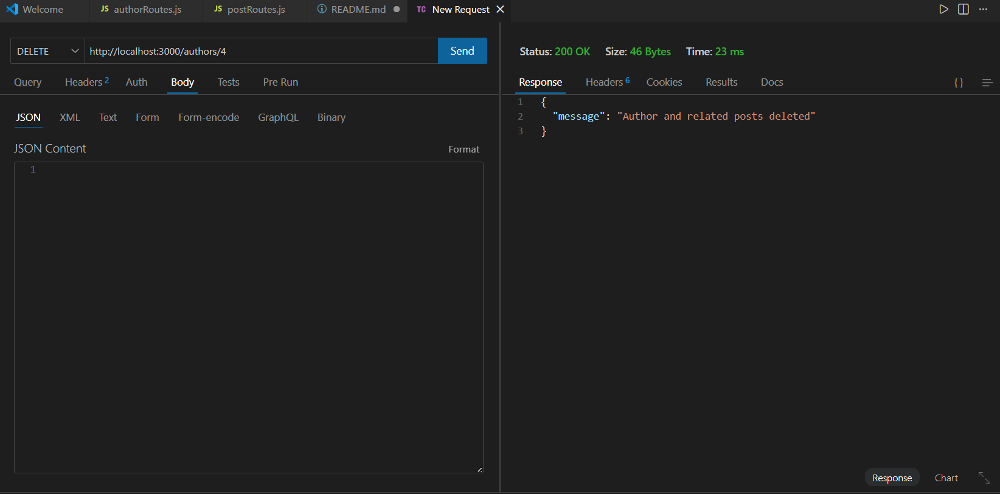

---

### 6️⃣ Get All Posts of a Specific Author — `GET /authors/{id}/posts`

---

### 7️⃣ After Author Deletion (Cascade Check)

---

## 📝 POST ENDPOINTS

### 8️⃣ Create Post — `POST /posts`

---

### 9️⃣ Get All Posts — `GET /posts`

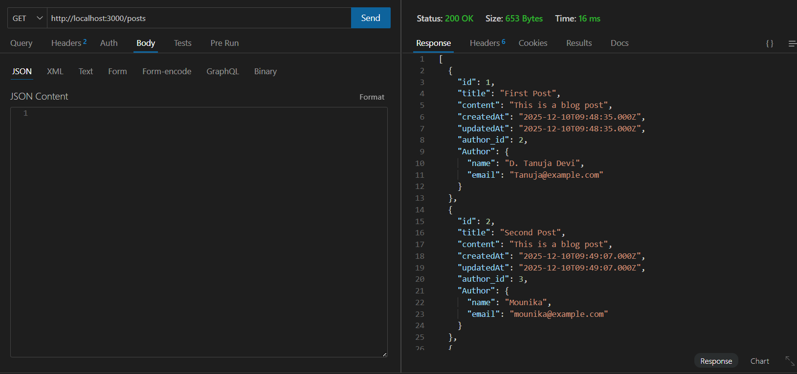

---

### 🔟 Filter Posts by Author — `GET /posts?author_id={id}`

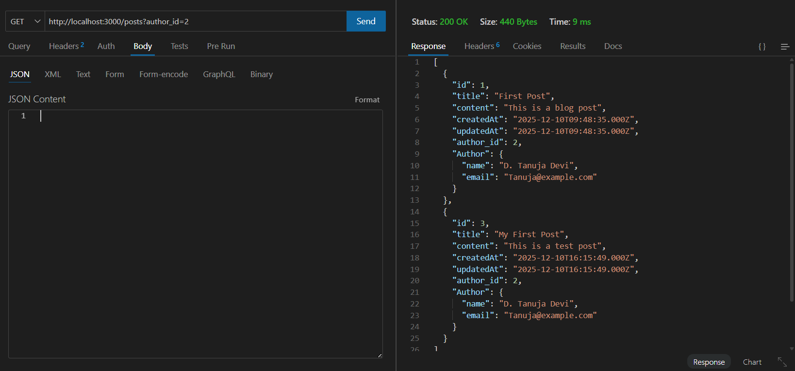

---

### 1️⃣1️⃣ Get Post by ID — `GET /posts/{id}`

---

### 1️⃣2️⃣ Update Post — `PUT /posts/{id}`

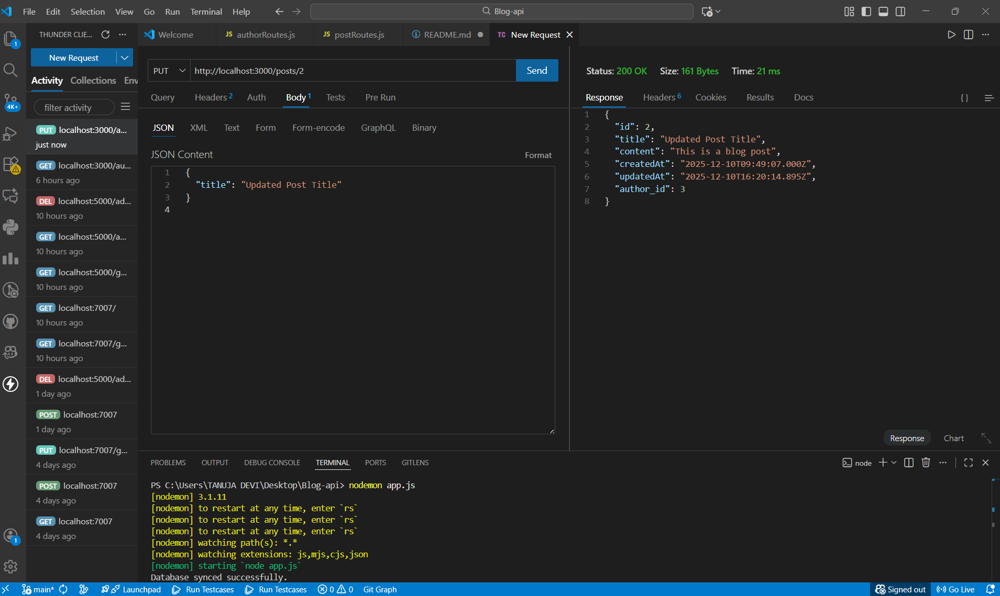

---

### 1️⃣3️⃣ Delete Post — `DELETE /posts/{id}`

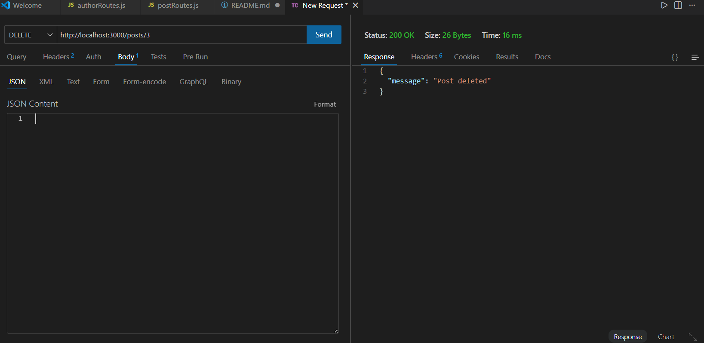

---

## ❌ Validation & Relationship Cases

### 1️⃣4️⃣ Invalid Author While Creating Post

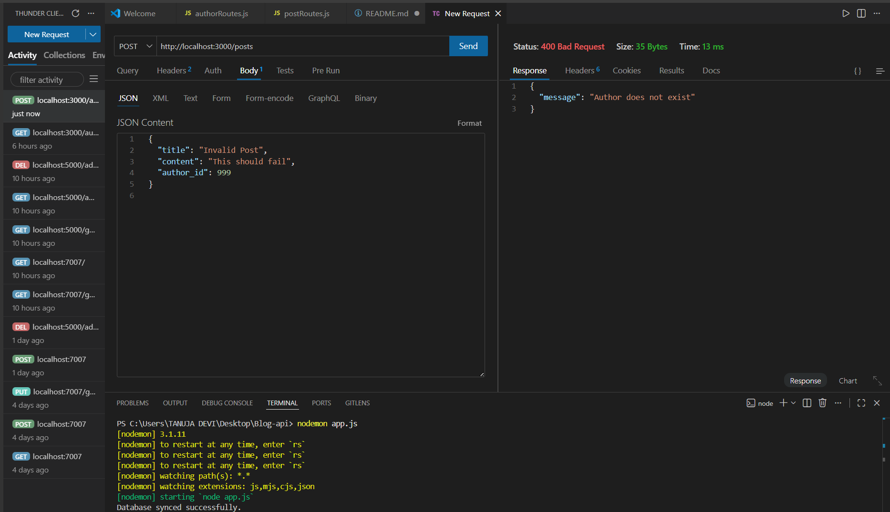

---

### 1️⃣5️⃣ Cascade Delete Verification

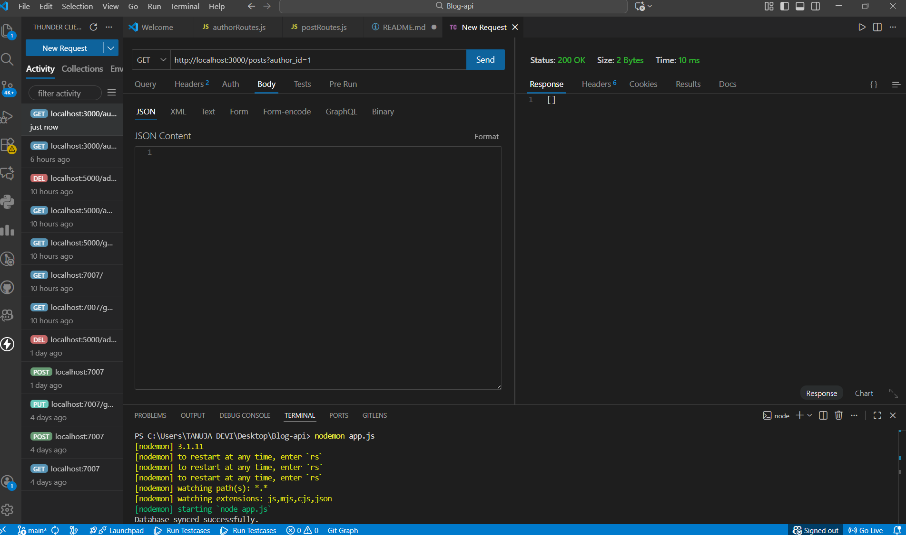

---
